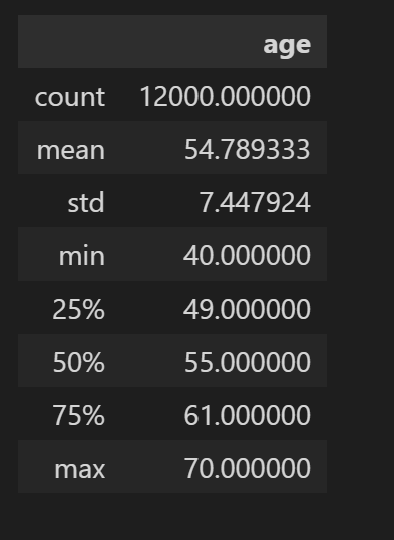

# Notes for predicting Age of the UkBiobank datset

 

# Network with 1 FC layer 
- Started with plain network that has 1 FC layer
- The Batch norm was followed after the activation
    ###  Results 
        1. If the learning rate was high there was the problem of vanishing gradient

# Plain Networks with small learning rate
- Experimented with 3 smaller learning rates with the same 
    
    ###  Results 
    
    >  Worked well with lr = 0.0007 but was oveerfitting. - Job 5261664. However we have reached the minima at 70th epoch 

# Network with added drop out on the fc layer
- With the smaller learning rate and the dropout on the FC layer.
    ##  Results 
        1. Looks like underfitting 

# Reduce the dropout to 10% 

- Job 5263681 with learning rate 0.001 
    ##  Results 
        1. Training error has reduced compared to the 20% dropout   

# Trying model from paper [brain age](https://www.ncbi.nlm.nih.gov/pmc/articles/PMC7610710/)

- Did not use their sigmoid layer. Instead used the FC layers for regression.

- Using MAE was able to fit model with error of 3 years [5335292](out5335292.out) line 25

# Model with 2 FC layers
- Did not improve the MAE. ref: [5393704](out5393704.out)

# Try the same model with all the samples
- Was able to reduce the error to 2.5 without overfitting. Ref: [5415909](out5415909.out). Line 40 epoch 37.

# Different learning rates for CONV layers and FC layers

- <b> The minimum error reached before overfitting was 3 epoch 25 of [5416056](out5416056.out) </b>

### 1. Adding dropout to the First conv layer
    - No change from the model without dropout. 
    - Only 12000 samples were used

### 2. Adding droput to only 2nd layer: Job [5418772](out5418772.out)
     - No change from without dropout

### 3. Adding dropout to middle 3 layers: Job [5429162](out5429162.out)

### 4. Adding dropout to all the layers: Job [5429170](out5429170.out)

 

# Start transfer learning with the gender
    - Fix the Conv layers and only train the FC layer with sigmoid

## 1. Without transfer learning 
    - The accuracy is 98%

## 2. With transfer learning
  

#### Job [5458898](out5458898.out) run with 20k data :  Stopped due to timeout 
    - Accuracy was improving in both training and testing

 

#### Job [5458900](out5458900.out) run with all data :  Stopped due to timeout 
    - Accuracy was improving in both training and testing

 

#### Job [5460432](out5460432.out) distributed learning for faster training :  Done 
    - Max accuracy reached is 0.80

#### Job [5503087](gpu4_5503087.txt) Distributed learning with last first 4 layers fixed :  Done  
    - Accuracy of almost 99% percent

 

# Starting transfer learning with the cognitive scores (Number of Digits remembered)

## With transfer learning 

 

#### Job [5526067](gpu4_5526067.txt) Distributed learning with all layers fixed except FC layer:  Done 
    - MSE of 2.3 for train and 2.4 for validation

#### Job [5704714](gpu4_5704714.txt) Distributed learning with 4 CONV layers fixed:  Done  
    - MSE of 2.2 on training and 2.4 on validation

#### Job [5720439](gpu4_5720439.txt) Distributed learning with 4 CONV layers fixed; Last CV layer has lr=1e-3 and FC layer has lr=1e-2:  Done  
    - MSE of 1.4 for train and 1.7 for validation

#### Job [5932653](gpu4_5932653.txt) Using classification with scores of 4 to 9:   Done
    - Max accuracy is 32%
    - Need more non linearity

#### Job [5936860](gpu4_5936860.txt) Using 2 FC layers with scores of 4 to 9
    - Overfitting. Validation score do not improve
    - Colud be due to imbalance in train and valid splits

#### Job [5936900](gpu4_5936900.txt) Using 2 FCs. Dropout for FC2. Stratified Sampling:  Done
    - Still overfitting. Validation score stuck at 0.32

#### Job [5937301](gpu4_5937206.txt) Using 2 FCs. Removed transfer learning. Stratified Sampling:  Done
    - Under learning
    - Need more non-linearity

#### Job [5937907](gpu4_5937907.txt) Using 2 FCs. With transfer learning. Stratified Sampling. 4 Layers fixed. 2 Dropouts on FCs:  Done
    - Under fitting. Loss does not change

#### Job [5937908](gpu4_5937908.txt) Using 2 FCS. No dropout on both FCs. Stratified Sampling:  Done
    - Overfitting 

#### Job [5938205](gpu4_5938205.txt) Using 2 FCs. Dropout p=0.2 on 2nd Fc. Stratified Sampling:  Done
    - Overfitting. 

#### Job [5938212](gpu4_5938212.txt) Using 2 FCs. Dropout p=0.2 on 2nd FC. Uses 11 outputs for 6 classes:  Done
    - Stopped due to preemption

#### Job [5938402](gpu4_5938402.txt) Using 2 FCs. Added Confusion Matrix:  Done
    - Overfitting. Unable to learn the smaller class.

#### Job [5938789](gpu4_5938789.txt) Using 2 FCs. With dropout on 2nd FC. Added class weights:  Done
    - Max accuracy at epoch 51. With accuracy of 0.288, 0.24

#### Job [5939898](gpu4_5939898.txt) Using 2 FCs. Added class weights :  Running
    - Best model performance of epoch 53. Accuracy of 29% and 24%

#### Job [5939925](gpu4_5939925.txt) Using 2 FCs. Added class weights. Added Sex after Convs:  Running
    - Not learning

#### Job [5942991](gpu4_5942991.txt) Using 2 Fcs. With only 3 bins.

#### Job [5943518](gpu4_5943518.txt) Using 2fcs. With dropout on 2nd fc. Only lower and upper memory scores:  Done 
    - Accuracy of 54%

#### Job [5943807](gpu4_5943807.txt) Using 2fcs. Without any dropouts on FCs:  Running
    - 

#### Job [5943809](gpu4_5943809.txt) Using 3Fcs. 2 bins. :  Done
    -
 
#### Job [5943976](gpu4_594397.txt) Using 3Fcs. Lr=0.07   
    - 

#### Job [5943987](gpu4_5943987.txt) Using 3Fcs. Replaced with Tanh function for activation on the FCs.  
    - 

#### Job [5944417](gpu4_5944417.txt) Using 3 FCs. Random Under sampling of majority class. With weights
    - Need to rerun

#### Job [5944780](gpu4_5944780.txt) Using 3 Fcs. Random oversampling of both classes to 10000 each
    - Excellent learning. But the network has inflated validation results
    
#### Job [5945520](gpu4_5944780.txt) Using 3 FCs. RUS with augmentation. 
    - Reduced overfitting

#### Job [5945520](gpu4_5945520.txt) Using 3 Fcs. RUS without augmentation.
    - Epoch 114. Training,validation : 79, 72 

#### Job [5950035](gpu4_5950035.txt) Using 3 FCs. RUS with augmentation.
    - Epoch 181. Training 73 validation 65. 

#### Job [5950094](gpu4_5950094.txt) Using 3 FCs. RUS without augmentation.
    - 

#### Job [5950165](gpu4_5950165.txt) sing 3 FCs. RUS without augmentation. With stratified sampling.
    - 

# Presenting the results
## Transfer vs No transfer learning
## How to get the error interval?

# Focus on transfer learning benefits.
    ## Udersampling (graph showing the mean and std)
    ## with and without transfer learning
# Brain regions
    ## Important regions

#### Job [6055826](gpu4_6055905.txt) Using 
#### Job [6055905](gpu4_6055905.txt) Using 3 FCs without augmentation and no transfer learning
#### Job [6056972](gpu4_6056972.txt) Using random state 62
#### Job [6057006](gpu4_6057006.txt) Using random state 72
#### Job [6057125](gpu4_6057125.txt) Using random state 82
#### Job [6060702](gpu4_6060702.txt) Using random state 112
#### Job [6060739](gpu4_6060739.txt) Using random state 52 - Retesting

#### Job [6061548](gpu4_6061548.txt) Freezing 3 conv layers. 2 FC layers 
#### Job [6061553](gpu4_6061553.txt) Freezing 3 conv layers. 2 Fc with dropout on 1. 
#### Job [6061729](gpu4_6061729.txt) Freezing 3 conv. 2 Fc with dropout on 1. With momentum 1e-4
#### Job [6061756](gpu4_6061756.txt) Freezing 3 conv. lr=0.001,momentum=1e-5
#### Job [6062617](gpu4_6062617.txt) Freezing 3 conv. lr=0.001,momentum=1e-6
#### Job [6064280](gpu4_6064280.txt) Freezing 3 conv. lr=0.001,momentum=1e-6. drop 0.1, rs=112
#### Job [6065946](gpu4_6065946.txt) Same. Sample sie increased to 2250 for 0s, rs=112
#### Job [6066159](gpu4_6066159.txt) Same. rs=52

#####
# 1. BrainAge model
    i) 5-cross validation - 5 models (Each model having differnt hyperparameters)

# Hyper parameter tuning for brain age

### Job [6164265](gpu4_6164265.txt) Fc layers = 1
### Job [6173079](gpu4_6173079.txt) Fc layers = 2 
### Job [6183834](gpu4_6183834.txt) Fc layers = 3
### Job [6189282](gpu4_6189282.txt) Fc layers = 4

# Hyper parameter - layers tuning for working memory prediction

### Job [6239512](gpu4_6239512.txt) Fc layers = 1